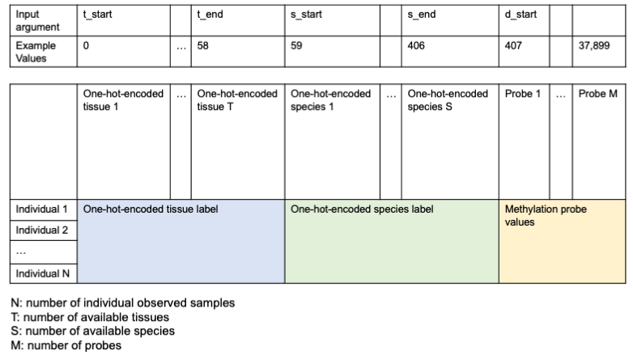

# CMImpute
<a href="https://www.biorxiv.org/content/10.1101/2023.11.26.568769v1">Cross-species and tissue imputation of species-level DNA methylation samples across mammalian species.</a>

CMImpute (Cross-species Methylation Imputation) is a imputation method based on a Conditional Variational Autoencoder (CVAE) to impute methylation values for species-tissue combinations that have not previously been experimentally profiled. CMImpute takes as input individual methylation samples along with their corresponding species and tissue labels. CMImpute outs a species-tissue combination mean sample, or combination mean sample for short, that represents a species' average methylation values in a particular tissue type.


## Precomputed combination mean samples

Final imputed species-tissue combination mean samples for species and tissue combinations that have not been experimentally profiled (19,786 magenta imputed combinations in figure above) can be found <a href="https://public.hoffman2.idre.ucla.edu/ernst/0TDK7/">here</a>.

## Dependencies
- keras 2.10.0
- numpy 1.23.4
- pandas 1.4.4
- scikit-learn 0.24.2
- scipy 1.9.3
- tensorflow 2.10.0

## Data Format
The training data input should be formatted as such. Example training inputs can be found in the example directory.
- First column containing row names
- First row containing species and tissue names folowed by probe name
- Data consisting of one-hot encoded species and tissue labels followed by methylation values



## Step 1: Select Hyperparameters
Hyperparameters are selected by performing a grid search over different combinations of the following hyperparameters: number of hidden layers, hidden layer dimensions, activation function, learning rate, episilon, and latent space dimension. Refer to the manuscript for details on the hyperparameter values being tested. Use hyperparameter_tuning.py to train a model and record the performance for each hyperparamter combination.

The training data (training_data) contains individual methylation samples, with multiple potentially correponding to the same species-tissue combination. The observed combination mean samples (combo_averages) contain one sample per species-tissue combination representing the average methylation values. The example_data directory demonstrates the format. This data can be a .pickle, .csv, or .tsv file.
```
python3 hyperparameter_tuning.py -h

Loading arguments
usage: Hyperparameter Tuning Script [-h] [--val_seed VAL_SEED]
                                    combo_averages training_data t_start t_end s_start s_end d_start index output_dir

Trains a CVAE model based on a hyperparameter combination and saves the performance to a file

positional arguments:
  combo_averages       Path to .pickle, .csv, or .tsv for observed combination mean samples
  training_data        Path to .pickle, .csv, or .tsv for individual training samples
  t_start              Position of first one-hot-encoded tissue in the training data
  t_end                Position of last one-hot-encoded tissue in the training data
  s_start              Position of first one-hot-encoded species in the training data
  s_end                Position of last one-hot-encoded species in the training data
  d_start              Position of first probe in the training data
  index                Index of the hyperparameter combination
  output_dir           Path to output where hyperparameter combination performances will be scored

optional arguments:
  -h, --help           show this help message and exit
  --val_seed VAL_SEED  Random seed for selecting the validation dataset
```
Below is an example using the training data and observed data provided in the example_data directory. This is designed to specifically use a val_seed of 7558 to predict human blood and horse heart. There are 828 hyperparameter combinations that can be tested. The performance result will be saved in an individual file per combination in the designated output_dir.
```
python3 hyperparameter_tuning.py example_data/observed_combo_mean_samples.csv.gz example_data/train.csv.gz 0 58 59 406 407 1 example_data/best/ --val_seed 7558
```

## Step 2: Train Model
There are two ways to train the model: by index (same index determined during hyperparameter selection) or by manual entry of the desired hyperparameters.

### Select hyperparameters via index
```
python3 train_model_by_index.py -h
usage: Model Training Script [-h] [--val_seed VAL_SEED] [--seed SEED]
                             training_data t_start t_end s_start s_end d_start index encoder_save_loc decoder_save_loc

Trains a CVAE model based on the index of the hyperparameter combination from the grid search and saves the model to a
specified location

positional arguments:
  training_data        Path to .pickle, .csv, or .tsv for individual training samples
  t_start              Position of first one-hot-encoded tissue in the training data
  t_end                Position of last one-hot-encoded tissue in the training data
  s_start              Position of first one-hot-encoded species in the training data
  s_end                Position of last one-hot-encoded species in the training data
  d_start              Position of first probe in the training data
  index                Index of the hyperparameter combination
  encoder_save_loc     Path to location to save trained encoder model
  decoder_save_loc     Path to location to save trained decoder model

optional arguments:
  -h, --help           show this help message and exit
  --val_seed VAL_SEED  Random seed for selecting the validation dataset
  --seed SEED          Random seed used to initiate model training
```
Below is an example using training data provided in the example_data directory. 
```
python3 train_model_by_index.py example_data/train.pickle 0 58 59 406 407 1 example_data/encoder_1_by_index.model example_data/decoder_1_by_index.model --val_seed 7558 --seed 6091
```
### Manually enter hyperparameters
```
python3 train_model_by_params.py -h
usage: Model Training Script [-h] [--val_seed VAL_SEED] [--seed SEED]
                             training_data t_start t_end s_start s_end d_start encoder_save_loc decoder_save_loc n
                             activation_function latent_space_dimension learning_rate epsilon layout_index

Trains a CVAE model based on inputted hyperparameters and saves the model to a specified location

positional arguments:
  training_data         Path to .pickle, .csv, or .tsv for individual training samples
  t_start               Position of first one-hot-encoded tissue in the training data
  t_end                 Position of last one-hot-encoded tissue in the training data
  s_start               Position of first one-hot-encoded species in the training data
  s_end                 Position of last one-hot-encoded species in the training data
  d_start               Position of first probe in the training data
  encoder_save_loc      Path to location to save trained encoder model
  decoder_save_loc      Path to location to save trained decoder model
  n                     Hidden layer dimension 2**n
  activation_function   Activation function for neural network training (i.e. relu, sigmoid, tanh)
  latent_space_dimension
                        Size of encoded latent space
  learning_rate         Learning rate used by the Adam optimizer
  epsilon               Epsilon used by the Adam optimizer
  layout_index          Integer between 0 and 4 to select the layout of hidden layers (see paper for options)

optional arguments:
  -h, --help            show this help message and exit
  --val_seed VAL_SEED   Random seed for selecting the validation dataset
  --seed SEED           Random seed used to initiate model training
```
Below is an example using training data provided in the example_data directory.
```
python3 train_model_by_params.py example_data/train.csv.gz 0 58 59 406 407 example_data/encoder_1_by_params.model example_data/decoder_1_by_params.model 8 relu 2 0.001 1e-7 0 --val_seed 7558 --seed 6091
```

## Step 3: Perform imputation
Once trained models are saved, the final imputation of species-tissue combination mean samples can be performed.


